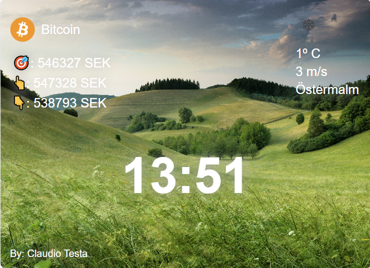

# Personal dashboard

## Description
This app is an exercise in fetching data from API's. 

A random backround image is fetched from the free [Unsplash site](https://unsplash.com/).
The current Bitcoin currency and weather are also fetched and displayed on the page.

 

## Technologies
- HTML
- CSS
- JavaScript

## Live link
The application is deployed here:
[https://toms-dashboard.netlify.app](https://toms-dashboard.netlify.app)

Please feel free to click around and explore!
